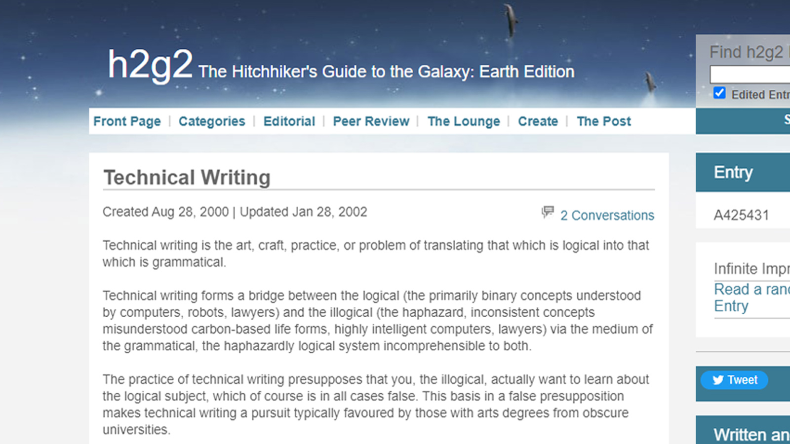

# [Robert R. Chapman, Jr.](https://rrchapman.us/)  

> In our culture–I exaggerate only slightly–those who know cannot write, and those who can write do not know.  
>
> Norman Podhoretz, “In Defense of Editing,” October 1965 issue of Harper’s Magazine  

I have successfully performed a variety of technical communication tasks for over 30 years:  

- Editor  
- Writer  
- Web-based training developer  

This has been in these industries:  

- Computer hardware and software  
- Aerospace  
- Cellular telephone  

My products have included the following:  

- Technical white papers  
- Training  
- Marketing materials and communications  
- On-line help  
- User interface text  
- Software documentation  

---

## Work experience since 2000  

### Information Group Northwest (CDW), Portland, Oregon  

#### Dates  

October 2022 to January 2023  

#### Worksite  

Telecommute  

#### Client  

Ulta Beauty, Network Services, Bolingbrook, Illinois  

#### Job Title  

Technical Writer  

#### Accomplishments  

Find, organize, cleanup, and store documentation for Network Services in Jira Confluence. This included creating the repository in Confluence, using HTML.  

#### Tools  

Microsoft Office 360 (Word, PowerPoint). Microsoft SharePoint. Atlassian Confluence. HTML.  

### Hi-Tech Talents, LLC, Bellevue, Washington  

#### Dates  

June 2022 to August 2022  

#### Worksite  

Telecommute  

#### Client  

Microsoft Cloud Hardware and Infrastructure Engineering, NPI Infrastructure and Cloud Engineering, Redmond, Washington  

#### Job Title  

Technical Writer  

#### Accomplishments  

Collaborate with stakeholders and subject matter experts to define standard operating procedures for designing and building converged hardware platforms.  

#### Tools  

Microsoft Office 360 (Word, PowerPoint), Microsoft Visio.  

### Information Group Northwest (CDW), Portland, Oregon  

#### Dates  

November 2021 to March 2022  

#### Worksite  

Telecommute  

#### Client

Adelman Travel Group, Information Services, Milwaukee, Wisconsin  

#### Job Title  

Technical Writer  

#### Accomplishments  

Prepare technical documentation for a computer system security audit. This included creating graphics, including network diagrams. Topics included security protocols, using software as a service, HTTP, and web APIs.  

#### Tools  

Microsoft Office 360 (Word, PowerPoint), Microsoft Visio. Teamwork.  

### Hitachi Vantara, Santa Clara, California  

#### Dates  

December 2017 to December 2020  

#### Worksite  

Telecommute  

#### Groups  

Converged Solutions Engineering and Technical Publications  

#### Job Title  

Technical Editor (Senior Technical Writer)  

#### Accomplishments  

Publish technical papers describing converged solution implementation with Hitachi hardware and various software companies. Translated engineering to English. Enforced branding standards. Reworked content to be suitable for the audience. Kept document catalog information in Microsoft SharePoint, producing reports on documents by analyzing in Microsoft Excel.  

Collaborative content editing with engineers and stakeholders located internationally. Coordinate publishing with Marketing Communications and other internal teams. Found creative solutions to successfully conquer problems, such as incomplete or unapproved branding. Solved issues with Word for colleagues. Participated in a committee determining technical writing style and usage. Coached engineers on how to create web-friendly content.  

#### Tools  

Microsoft Office 360 (Word, Excell, PowerPoint), Microsoft Visio, Microsoft SharePoint, Atlassian Jira, Adobe FrameMaker 2019, Salesforce Slack, Oxygen XML Author 20.0 (DITA), SDL Tridion Docs (version control), TechSmith SnagIt. Internal style guides with guidance from Microsoft Manual of Style and AP Stylebook.  

### netPolarity, Campbell, California  

#### Dates  

April 2011 to December 2017  

#### Worksite  

Telecommute  

#### Client  

Hitachi Vantara, Solution and Cloud Engineering, Santa Clara, California  

#### Job Title  

Technical Editor  

#### Accomplishments  

Publish technical papers describing the implementation of solutions using products from Hitachi and partners. Translated engineering to English. Enforced branding standards. Reworked content to be suitable for the audience.  

Work remotely with writers located internationally. Prepare documents for localization. Coordinate with Marketing Communications and other internal teams. Created Microsoft Word template file (.dotx) to simplify moving content from Word to FrameMaker. Moved document catalog information from Microsoft Excel to Microsoft SharePoint so others would have access to this information without going through me. Exported cataloging information from SharePoint to Excel to analysis (find documents on certain subjects, products, publication dates).  

Awarded the “Wa” Spirit Award (for harmony, trust, respect) with an FTE employee for work eliminating a serious publishing backlog when I started. Given the Superhero award for contributions to internal social networking website. Solved issues using Word for colleagues. Coached engineers on how to create web-friendly content.  

#### Tools  

Microsoft Office 2010, Adobe FrameMaker 10 and 11. TechSmith SnagIt. Internal style guides, also using Microsoft Manual of Style, AP Stylebook, and Yahoo Style Guide.  

### iSoftStone, Kirkland, Washington  

#### Dates  

November 2010 to December 2010  

#### Worksite  

Telecommute as a 1099 contractor  

#### Client  

AT&T Mobility, Redmond, Washington, office  

#### Job Title  

Editor and Copywriter  

#### Accomplishments  

Because of the quality of my work on the AT&T Mobility developer web site (see Creative Circle, below), called to edit and write copy for the AT&T 2011 Developer Summit. Praised for team communication, quick turnaround, attitude, and general product quality.  

Subjects included mobile development, web APIs, and web content development.  

#### Tools  

Microsoft Office 2010. Microsoft Manual of Style for Technical Publications and AP Stylebook.  

### Volt Technical Resources, Kirkland, Washington  

#### Dates  

July 2010 to October 2010  

#### Worksite  

Microsoft, Bellevue, Washington (not Redmond)  

#### Client  

Microsoft Dynamics CRM UE team  

#### Job Title  

Technical Editor II  

#### Accomplishments  

Edit user assistance material, special interest articles, and SDK articles for Microsoft Dynamics CRM version 5. Content included information for programmers creating an interface with Dynamics CRM (API information).  

Saved significant expense without cutting quality by quickly editing content mostly edited before I arrived for a localization handoff from 50,000 words to 33,000 words. Agile project management used when approaching delivery date.  

#### Tools  

Author-it 5.4, DxStudio 2007, Microsoft Office 2010, Microsoft Product Studio 2.10. Microsoft Manual of Style for Technical Publications and internal style guides.  

### Creative Circle, Seattle, Washington  

#### Dates  

May 2010 to July 2010  

#### Worksite  

Telecommute  

#### Client  

iSoftStone in Kirkland, Washington (for AT&T Mobility developer web site)  

#### Job Title  

Technical Editor  

#### Accomplishments  

Edit documentation for a mobile device developer audience for AT&T Mobility. Content included programming language information for programmers (including JavaScript), API information, software as a service, HTTP, mobile development, and web content development.  

Quickly rescued at-danger project timelines while meeting AT&T quality standards.  

#### Tools  

Microsoft Office 2007. Microsoft Manual of Style for Technical Publications and internal style guides.  

### COMSYS, Inc., Bellevue, Washington  

#### Dates  

April 2010 to May 2010  

#### Worksite  

Telecommute  

#### Client  

Microsoft  

#### Job Title  

Editor  

#### Accomplishments  

Edit documents for Microsoft Services Offerings. Primary edit was for LCA (Legal) standards, although included all aspects of copyediting. Material included sales and technical material in various formats (documents, spreadsheets, presentations). While COMSYS was a vendor to Microsoft, I was not a “v-dash” contractor (vendor).  

#### Tools  

Microsoft Office 2007. Microsoft Manual of Style for Technical Publications and internal style guides.  

### COMSYS, Inc., Bellevue, Washington  

#### Dates  

February 2010 to March 2010  

#### Worksite  

Telecommute  

#### Client  

Microsoft  

#### Job Title  

Editor  

#### Accomplishments  

Edited documents as part of a team for Microsoft Services Offerings. Same as April 2010 to May 2010.  

#### Tools  

Microsoft Office 2007. Microsoft Manual of Style for Technical Publications and internal style guides.  

### Aquent, Seattle, Washington  

#### Date  

January 2010  

#### Worksite  

Microsoft, Redmond, Washington  

#### Client  

Microsoft Windows Server UA Team  

#### Job Title  

Technical Editor  

#### Accomplishments  

Create system help for a tool used by an IT audience. Copyedit documentation written by subject matter experts, with some content writing. Content included programming and hardware information.  

#### Tools  

DxStudio 2007, Microsoft Word 2010, and Microsoft SharePoint. Microsoft Manual of Style for Technical Publications and internal style guides.  

### Robert Half Technology, Seattle, Washington  

#### Dates  

November 2008 to December 2008  

#### Worksite  

Casey Family Programs, Seattle, Washington  

#### Client  

Casey Family Programs  

#### Job Title  

Technical Writer  

#### Accomplishments  

Created and documented system tests used for in-house and commercial applications to verify operations after applying system patches. Created templates to create tests, over objections of the developers who thought it was unnecessary. Performed tests using command line and GUI. Found problems the developers had missed, including an error in production (not development).  

#### Tools  

Microsoft Office 2007, TechSmith SnagIt, and Microsoft SharePoint. Based style on Microsoft Manual of Style for Technical Publications.  

### COMSYS, Inc., Bellevue, Washington  

#### Dates  

August 2008 to September 2008  

#### Worksite  

Washington Mutual Tower, Seattle, Washington  

#### Client  

Washington Mutual  

#### Job Title  

Technical Writer  

#### Accomplishments  

Write content for a revised project management life cycle. Create macros for Word templates and customizations for Excel templates.  

#### Tools  

Microsoft Office, Microsoft Project, TechSmith SnagIt, and Microsoft SharePoint. AP Stylebook and Microsoft Manual of Style for Technical Publications.  

### AT&T Mobility (Cingular Wireless, LLC), Atlanta, Georgia  

#### Dates  

January 2008 to July 2008  

#### Worksite  

Bothell, Washington  

#### Group  

Business customer accounts  

#### Job Title  

Senior Copy Writer (Senior Marketing Manager in HR system)  

#### Accomplishments  

Create user interface text for on-line applications. Write copy for web demonstrations, including marketing communications. Produced Adobe Flash presentations using Adobe Captivate. Edit the work of others.  

#### Tools  

Adobe Captivate, Adobe Photoshop, Microsoft SharePoint, and Microsoft Office. Microsoft Manual of Style for Technical Publications, AP Stylebook, and internal style and use guidelines.  

### MediaPro, Bothell, Washington  

#### Dates  

February 2007 to December 2007  

#### Worksite  

Verizon Wireless, Bellevue, Washington  

#### Client  

Verizon Wireless Training  

#### Job Title  

Instructional Designer  

#### Accomplishments  

Design and produce web-based training, primarily for in-store staff. Trained to work as an administrator in both learning content management systems (CMS) in use at the time at Verizon Wireless. Content developed from subject matter expert interviews and review of existing documentation. Courses created to follow WCAG standards.  

#### Tools  

Adobe Captivate, Adobe Flash, Adobe Dreamweaver CS3, Adobe Photoshop, Adobe Illustrator CS3, Adobe RoboHelp, Oracle PeopleSoft, and Microsoft Office products. Web Content Accessibility Guidelines (WCAG). Microsoft Manual of Style for Technical Publications and internal style guides.  

### Intrepid Learning Solutions, Seattle, Washington  

#### Dates  

March 2005 to January 2007  

#### Worksite  

Intrepid Learning Solutions, Seattle, Washington, and Boeing Commercial Airplanes, Everett, Washington  

#### Job Title  

Technical Writer  

#### Accomplishments  

Create web-based training, including text, storyboards, graphics, HTML, and cascading style sheets (CSS) for use in courses. While hired initially to only write the course modules, they soon discovered I could produce courses from beginning to end. Courses were primarily on how to use internal software product implementations such as SLATE ([System Level Automation Tools for Engineers](https://www.mathworks.com/products/connections/product_detail/slate.html)) at Boeing, but work included other topics (such as occupational health and safety). Content developed by interviewing subject matter experts and reviewing documentation. Courses created to comply with WCAG web accessibility requirements, as a customer requirement (alt text, text size, title text on controls, and so forth.)  

#### Tools  

Adobe Captivate, Adobe Flash, Adobe Dreamweaver, Adobe Fireworks, Adobe RoboHelp, and Microsoft Office products. Web Content Accessibility Guidelines (WCAG). Various Boeing style manuals, Gregg manual (Boeing), and the Microsoft Manual of Style for Technical Publications.  

### Physicians Micro Systems Incorporated, Seattle, Washington  

#### Dates  

October 2004 to March 2005  

#### Worksite  

Seattle, Washington  

#### Job Title  

Technical Writer (temporary)  

#### Accomplishments  

Produce user manuals and on-line help for an electronic medical records system.  

#### Tools  

Adobe RoboHelp and Microsoft Office. Microsoft Manual of Style for Technical Publications.  

### Iron Mountain Incorporated, Boston, Massachusetts  

#### Dates  

March 2000 to May 2004  

#### Worksite  

Iron Mountain Off Site Data Protection, Renton, Washington  

#### Group  

Training and software development  

#### Job Title  

Documentation Specialist (final title)  

#### Accomplishments  

Create manuals and help for Secure Base, SecureSync, and an internal time management system, using developer documentation (with code samples) and subject matter experts. Perform quality assurance work, including SQL tests using a command line interface (CLI) written by others but modified by me for the test. Repurpose existing documentation and prepared new material for call center use. Provide content for instructional designers. Worked with the team designing the user interface to make it easier for me to document.  

#### Tools  

Adobe RoboHelp, Adobe Dreamweaver, Adobe Fireworks, and Microsoft Office products and Microsoft Project. Information Mapping techniques, Microsoft Manual of Style for Technical Publications. Limited work with Adobe FrameMaker.  

---

## Education and training  

### University  

#### University of Sioux Falls, Sioux Falls, South Dakota  

No degree. Graduate and undergraduate courses related to secondary education, including special education reading specialist.  

#### Missouri University of Science and Technology, Rolla, Missouri  

Bachelor of Arts (History). Coursework includes 75% of a Bachelor of Science in Electrical Engineering degree, including 25 semester hours in Mathematics. Lacking an Astronomy course to have a minor in Physics.  

### Training  

#### Iron Mountain, Inc., Training, Boston, Massachusetts  

Information Mapping Seminar (class) on how to implement their writing and formatting techniques.  

### Seminars  

#### WritersUA (WinWriters), Seattle, Washington

Attended three WritersUA conferences on how to create user assistance documentation.  

---

## Contact information  

### Email  

<mail@rrchapman.us>  

### US Mail  

4404 Terrace Drive, Apartment 6, Everett, WA 98203  

### Telephone  

+1 (206) 963-5260  

---

## Trademark Information  

The names of the companies where I have worked are trademarks or registered trademarks of the respective owners.  

<dl>
<dt>Adobe</dt>  
<dd>Adobe, Acrobat, Captivate, FrameMaker, RoboHelp, and WebHelp are either registered trademarks or trademarks of Adobe Systems Incorporated in the United States and/or other countries.  </dd>

<dt>Atlassian  </dt>
<dd>Atlassian, Confluence, and Jira are trademarks of Atlassian Pty Ltd.  </dd>

<dt>Author-it  </dt>
<dd>Author-it is a registered trademark of Author-it Software Corporation.  </dd>

<dt>Information Mapping  </dt>
<dd>Information Mapping is the property of Information Mapping International NV.  </dd>

<dt>Microsoft  </dt>
<dd>Microsoft, Dynamics, FrontPage, Office, Publisher, Visio, SharePoint, Windows, and Windows Server are trademarks of the Microsoft Corporation in the United States, other countries, or both.  </dd>

<dt>Oracle  </dt>
<dd>Oracle is a registered trademark of Oracle Corporation and/or its affiliates.  </dd>

<dt>SyncRO Soft SR  </dt>
<dd>Oxygen is a trademark or registered trademark of SyncRO Soft SR.  </dd>

<dt>SDL Limited  </dt>
<dd>SDL and Tridion are trademarks or registered trademarks of SDL Limited.  </dd>

<dt>TechSmith  </dt>
<dd>SnagIt is a registered trademark of TechSmith Corporation.  </dd>
</dl>
